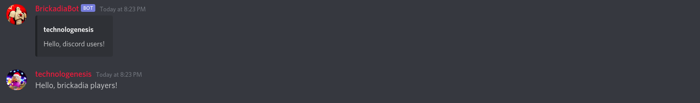
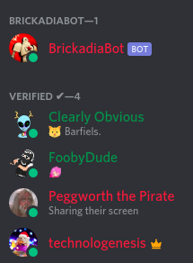

# Omegga-Discord

`Omegga-Discord` is an [Omegga](https://github.com/brickadia-community/omegga) plugin
allowing integration between a discord server and a Brickadia server.  It enables
moderators to moderate their Brickadia server remotely, and can be configured to enable
in-game players and Discord members to interact through chat features.

## Contents

- [Features](#features)
- [Installation](#installation)
- [Setup](#setup)
- [Configuration](#configuration)

## Features

Omegga-Discord has several distinct features that can be enabled or disabled mostly independently; take what you want,
leave what you don't.  See the [configuration](#configuration) section for details.

### Reporting

Players can use the `/report` command to issue a report to a server's moderators, even when the mods aren't present in
the server.


### Chat

In-game chat logs can be routed to a Discord channel, and messages sent to that channel can be relayed to the in-game
chat.




### Player Verification

In-game players can verify their Discord accounts with the `verify` command.  The `/whois` command can be used to show a
player's Discord username.

Optionally, a role can be assigned on verification and the user's nickname can be set to their in-game name.




### Tracking In-Game Players

A custom role can be used to designate in-game players


## Installation

Clone this repository into the `plugins` subdirectory of wherever you run Omegga from. Then from the cloned directory,
install the plugin dependencies:
```
cd <Omegga-dir>/plugins
git clone https://github.com/Technologenesis/omegga-discord.git
cd omegga-discord
git checkout tags/v1.0.0 #optional; the master branch should usually be stable,
                          # but releases act as additional guarantees of stability.
                          # However, the latest release may be missing experimental
                          # features.
npm i
```

For a greater guarantee of stability, checkout the latest *release* before running `npm i`:


## Setup

You will need to create your own Discord bot, give it the appropriate permissions in your server, and supply its
authorization token when configuring this plugin.  A detailed guide to setting up a Discord bot can be found
[here](https://discordpy.readthedocs.io/en/latest/discord.html).

The particular permissions your bot needs will depend on how you configure the plugin. Use the guide below to determine
what permissions your bot will need for your purposes

## Configuration

All configuration is handled through the Omegga web interface.  The various features are enabled with the listed config
options; each feature will require additional config options to be provided, or the plugin will not start correctly.

**If you are having trouble starting the plugin, double check this guide and ensure that your config and permissions are
set up accordingly.  Also be sure that you are using Discord IDs[*](#discordids) for your parameters, and double check
that they're correct.**

**Feature enablements**

| Name  | Feature | Default | Requires | Permissions |
|-------|---------|---------|----------|-------------|
| token | The whole thing - Omegga-Discord won't function without an auth token. | None
| mod-channel-id | If present, users will be able to send in-game reports to this channel | None | None; `mod-tag-id`[*](#discordids) is optional and will allow the bot to tag mods in reports. | Ensure that your bot is permitted to send messages in the given channel.  If `mod-tag-id` is provided, ensure the bot is permitted to tag that role
| enable-console-logs | Send console logs to `log-channel-id`? | false | `log-channel-id`[*](#discordids) | Ensure that your bot is permitted to send messages in `log-channel-id`
| enable-godspeak-for-mods | Relay messages posted by users with role `mod-tag-id` to `chat-channel-id` to in-game chat, with special [mod] indicator? | true | `chat-channel-id`[*](#discordids), `mod-tag-id`[*](#discordids) | Ensure that your bot is permitted to read messages in `chat-channel-id`
| enable-godspeak-for-users | Relay messages posted by any user to `chat-channel-id` to in-game chat? | false | `chat-channel-id`[*](#discordid) | Ensure that your bot is permitted to read messages in `chat-channel-id`
| enable-chat-log | Send chat logs to `chat-channel-id`? | false | `chat-channel-id`[*](#discordids).  Optionally, `log-game-events` can be used to log in-game events alongside chat messages. Only events that match the regex given in `server-event-screen` will be relayed; by default it is limited to join/leave messages. Removing this will allow all server events to come through. `compact-chat` enables a simpler, more compact format for chat logs. | Ensure that your bot is permitted to send messages to `chat-channel-id`
| enable-player-verification | Allow players to verify their Discord accounts? | true | `verify-timeout`; by default players are allotted 5 minutes to verify before needing to request another code. `verify-role-id` is an optional Discord role given to verified users. `change-nick-on-verify` is optional and causes Discord nicknames to be set to the player's in-game name. | If applicable, ensure your bot has permission to grant the given role and/or change user nicknames.
| enable-tracking-ingame-players | Designate in-game players in the given `guild-id` (AKA server) with the specified `ingame-role` ID? | false | `enable-player-verification`, `ingame-role`[*](#discordids), `guild-id`[*](#discordids) | Ensure that your bot is authorized to grant the given role. You will also need to give your bot the [*Server Members Gateway Intent*](#server-members-gateway-intent)
| invite-url | If present, the !discord command will broadcast the invite url to the server | None

<sup><a name="discordids">*</a>: To obtain the ID of a resource in discord, right-click on it in the interface and click "Copy ID".

## Server Members Gateway Intent

The Server Members Gateway Intent enables the bot to iterate over all server members, which is required for the in-game
role feature.  If you wish to use this feature, you will need to:
- go to the [applications tab on the Discord Developer Portal](https://discord.com/developers/applications)

- click on the application you will use for this bot - the one you set up in the [Setup](#setup) portion

  

- click on the bot tab

  

- turn on the Server Members Gateway Intent option

  